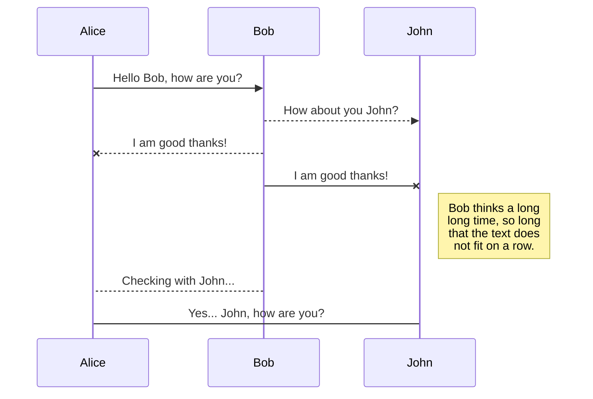
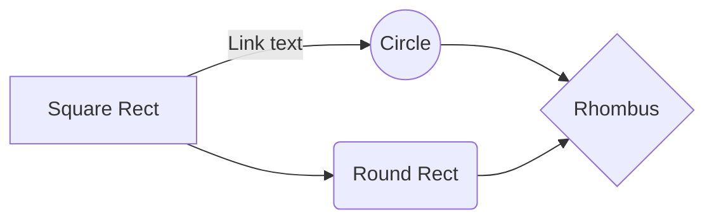

# Yosyp-Andriyash/sf-structure-generator

Hola!
Te doy la bienvenida al comando sf-structure-generator.
Este comando ha sido  creado con el propósito de agilizar el desarrollo estructuras en el entorno Symfony (v.5+)

El comando sirve para **generar diversas estructuras de directorios y ficheros** (.php) definidas por el usuario. Para ello, el usuario, crea distintas configuraciones, cada una de ellas orientadas al caso de uso que precise.
En la configuración del comando,  se define el índice principal  "**generativeOptions**", el cual contiene
todos los  casos de uso, cada caso de uso se identifica por un key en formato camelCase:

```  
commandConfiguration:
  ...
  generativeOptions:
    miCasoDeUso:
      ...
    miCasoDeUso2:
      ...
    miCasoDeUso3:
	  ...
```

Para cada "**generativeOption**" los pasos (en adelante steps) que ejecutará el comando, y para cada  step definido, existirán una serie de atributos que permitirán, a raíz de estos, generar la estructura final requerida.

# Configuración
Supongamos que este caso de uso lo hayamos definido con la clave **miCasoDeUso:** (listado en el ejemplo anterior).
Usaremos este caso de uso para ir describiendo una por una, todas las configuraciones y personalizaciones disponibles que nos ofrece este comando.
```  
commandConfiguration:
  ...
  generativeOptions:
    miCasoDeUso:
      ...
```
## PathConfig
La primera clave de la configuración de un caso de uso, se denomina **"pathConfig"**. Este parámetro contiene siguientes propiedades obligatorias que son relativas a la ubicación y salida de la estructura generada:
```
  generativeOptions:
    miCasoDeUso:
      pathConfig:
	    ...
```

* **outputPath**: La ubicación de salida de la estructura generada, relativa al proyecto. Ejemplos:
  ``` 
  outputPath: 'vendor/customercare/customercare/src/'
  ``` 
  ``` 
  outputPath: 'igor/src/'
  ``` 
  ``` 
  outputPath: 'src/Controller/'
  ``` 
  ``` 
  outputPath: 'src/'
  ``` 

* **rootNamespace**: Al generar cualquier estructura, este índice marcará el path base del namespace de las clases PHP generadas
  Ejemplos:
  ``` 
  rootNamespace: 'CustomerCare\'
  ``` 
  ``` 
  rootNamespace: 'App\'
  ``` 

* **calculatePathNamespaceCommencingBy**:  El directorio a partir del cual se calculará el namespace de cada uno de los ficheros que se generen.
  Ejemplos:
  ``` 
  calculatePathNamespaceCommencingBy: 'customercare/customercare/src/'
  ``` 
  ``` 
  calculatePathNamespaceCommencingBy: 'src/'
  ``` 
* **customMethodsClass**: El nombre de la clase que contiene métodos personalizados y exclusivos para la generación de las estructuras. Algo que veremos más adelante, son los callbacks en los steps de las plantillas, estos callbacks, son llamadas a métodos propios de php, métodos propios que suministra nuestro comando y/o métodos personalizados para el caso de uso.  **customMethodsClass** es el nombre la clase que suministra nuestros métodos personalizados para nuestro caso de uso. Ejemplos:
  ``` 
  customMethodsClass: 'App\Command\HexagonalStructureCommand\UserMethods'
  ``` 
  Se debe tener en cuenta que este parámetro es opcional y puede quedar vacío, pero si se define una clase, obviamente, dicha clase deberá existir. Si no existe, se deberá crear con la siguiente estructura base:
   ``` 
  <?php  
  
  namespace App\Command\HexagonalStructureCommand;  
  
  class UserMethods {
      public function __construct() {}

      public function miMetodoCustom1($argumento1, ...) {
       
      }  
  }
  ``` 

* **templateDispatcherNamespace**: Se consideran Dispatchers a las clases que se encargan de parsear dentro de las plantillas, las variables que se han introducido por parte del usuario alo largo de la ejecución. Resultado de ese proceso, son las clases y ficheros php que usaremos en nuestros desarrollos.  
  En **templateDispatcherNamespace** especificamos el namespace en donde se alojan estas clases. Sería equivalente al directorio en donde se encuentran estas clases pero en nomenclatura php namespace.

  Ejemplos:
  ``` 
  # si nuestros Dispatchers se alojan en el directorio 
  # "src/Command/HexagonalStructureCommand/Templates/" entonces
  templateDispatcherNamespace: 'App\Command\HexagonalStructureCommand\Templates'
  ```
  Si se no se establece ningún valor a esta propiedad, se tomará el valor por defecto establecido por el propio comando:  (DigiUtils\HexagonalStructureConstructor\Templates)

*  **templatesFilesPath**:  Es el directorio, relativo al directorio del proyecto en el que se guardan los templates que usrán posteriormente los dispatchers.
   Ejemplo:
   ``` 
   templatesFilesPath: 'src/Command/HexagonalStructureCommand/Templates/Files/'
   ``` 
   Por lo general, suelen o conviene que esten en un directorio cercano al directorio de los dispatchers
   Si se no se establece ningún valor a esta propiedad, se tomará el valor por defecto establecido por el propio comando:  (vendor/digi-utils/hexagonal-structure-constructor/src/Templates/Files)

Un ejemplo de configuración de "pathConfig", para, en este caso, la aplicación CustomerCare, sería la siguiente:
```
commandConfiguration:
  ...
  generativeOptions:
    miCasoDeUso:
      pathConfig:  
		outputPath: vendor/customercare/customercare/src/  
		rootNamespace: CustomerCare\  
		calculatePathNamespaceCommencingBy: customercare/customercare/src/  
		customMethodsClass: App\Command\HexagonalStructureCommand\UserMethods  
		templateDispatcherNamespace: ''  
		templatesFilesPath: ''
```

## Steps : [ Step ]
Dentro de steps, estableceremos los pasos o "preguntas" que debe ejecutar el comando, En sí, steps, es una coleccion de x elementos de tipo step. El parámetro steps no contiene ninguna configuración específica o propia si no que esta formada por elementos de tipo step.

Un step, es un mapa que contiene diversos parámetros que definen el comportamiento de cada paso que ejecuta el comando. Por lo general, utilizamos los step para acciones tales como preguntar al usuario el nombre de dominio, el nombre del caso de uso, si es un determinado tipo de acción, etc.

A continuación se definen las propiedades de un elemento de tipo step:

*  **stepTitle**:  Es el título de cada step. Se sitúa como encabezado en cada paso que se ejecuta en la consola. Se puede dejar este campo vacío aunque no se recomienda. Es recomendable establecer un título conciso. Si se quiere dar una explicación más detallada del step, se debe de usar el parámetro **stepDescription** que veremos a continuación.

   Se puede dejar este parámetro vacío o incluso no establecerlo, en cuyo caso, simplemente no se mostrará ningún  título en ese step.
   Ejemplo:
   ``` 
   miCasoDeUso:
     steps:
       -
         stepTitle: "Paso 1"  
   ``` 

* **stepDescription**:  Usamos este parámetro para roporcionar al usuario, por consola, una descripción del step que se esté ejecutando.
  ``` 
  miCasoDeUso:
    steps:
      -
        stepDescription: "Descripción del paso 1. ......"  
  ``` 
  Si queremos añadir una descripción más extensa, podemos asignar a dicho parámetro un array con un conjunto de textos, en los cuales cada elemento será una línea de texto:
  ``` 
  miCasoDeUso:
    steps:
      -
        stepDescription: [
            'línea 1 ...',
            'línea 2 ...',
        ] 
  ``` 
  Por último, y no menos importante, podemos mostrar variables definidas en steps previos en nuestra descripción usando el comodin **"%"** variable **"%"**. Esto quiere decir, que, si en un step anterior, definimos a la salida el nombre de variable (**stepOutputVarName**) el valor "contextName", en nuestra descripción, podemos hacer uso de ese valor de variable usando el scomodin %contextName%. Ejemplo:
  ```
  miCasoDeUso:
    steps:
      -
        stepDescription: 'Define el tipo de acción de %contextName%',
  ```

* **stepOutputVarType**:  Con este parámetro definimos el tipo de variable introducida por el usuario. Esto nos sirve para que el comando sepa qué tipo de casting precisa la variable dada, ya que por defecto, cualquier valor introducido por el usuario por consola, se considera de tipo string.
  Ejemplo:
  ``` 
  miCasoDeUso:
    steps:
      -
        stepOutputVarType: string | int | boolean | float,
  ``` 

* **stepOutputVarName**:  Usamos este parámetro para asignar el nombre o referencia del valor introducido. Este valor es el nombre que tendrá la variable en el transcurso de la ejecución del comando. Lo usaremos también en las plantillas para convertir en estas, dichos nombres por los valores introducidos por el usuario.
  Ejemplo:
  ``` 
  miCasoDeUso:
    steps:
      -
        stepOutputVarName: miNombreDeVariable,
  ``` 

* **stepOutputVarRegex**:   Este parámetro nos sirve para establecer un regex o patrón de validación con el cual validar el valor introducido por el usuario. Existe el patrón predefinido "className" que nos servirá para validar nombres de clase.
  Ejemplos:
  ``` 
  miCasoDeUso:
    steps:
      -
        stepOutputVarRegex: 'className',
        ...
      -
        stepOutputVarRegex: '/^(1|2)$/',
        ...
  ``` 

* **stepOnInputEndCallback**:  Este es un parámetro muy útil, ya que nos permite, una vez el usuario haya introducido un valor, hacer llamadas a diversos métodos o callbacks. Esto sirve para si por ejemplo queremos que una vez que el usuario haya introducido un valor, hacer alguna modificación al valor introducido (por ejemplo, un strtolower) o si queremos comparar el valor o cualquier fin que se nos ocurra y que pueda ser codificado dentro de un método.
  Podemos no solo establecer un solo callback, si no todos los que precisemos, entendiendo que se ejecutarán en el orden en que los hayamos establecido en la configuración.
  Dicho esto se muestra un ejemplo:
   ``` 
  miCasoDeUso:
    steps:
      -
        stepOnInputEndCallback: ['toLowerCamelCase'],
  ``` 

  Para este ejemplo, el método php que gestiona ese caso es el siguiente:

  ``` 
  <?php
    private function toLowerCamelCase(string $input): string  
      {  
        return StringHelper::formatToLowerCamelCase($input);  
      }
  ``` 

  Pero, ¿Qué ocurre si queremos pasar varios parámetros?

  En el ejemplo vemos que toLowerCamelCase es un método que recibe un solo parámetro, en cuyo caso se le asigna automáticamente el valor introducido por el usuario. Pero hay casos en los que queremos pasar más de un parámetro, o queremos pasar una variable ya establecida en un step previo.
  Para este caso, podemos hacer uso de los paréntesis después del nombre del método, y entre ellos, los parámetros que deseamos pasar: **nombreDelMetodo(variable1, 'valor', ...)**.
  > Es imprescindible saber que en los casos en los que se pasa más de un argumento, estos se pasan como un array de agumentos, posicionadose el argumento introducido por el usuario en el último iíndice de dicho array.

  Ejemplos:
  ``` 
  miCasoDeUso:
    steps:
      -
       stepOnInputEndCallback: ['ucfirst', 'miMetodo(propiedadDeStepAnterior)']
  ``` 
  Para este último caso, un ejemplo de método que recibirá esos argumentos puede ser el siguiente:
  ``` 
  <?php
    private function miMetodo(array $argumentos = [])
    {  
       $propiedadDeStepAnterior = $argumentos[0] ?? '';  
       $valorDelUsuario = $argumentos[1] ?? '';  
      
       ...
    }
  ``` 
  Por último, es importante saber dónde se posicionan los métodos personalizados. En el ejemplo hemos hecho referencia al método **toLowerCamelCase**, pero este método no es nativo de PHP, por lo menos no en las versiones actuales (2023). En este caso, toLowerCamelCase, es un método definido en la librería de métodos "custom" del propio comando.
  Entre estos se encuentran los siguientes:

  La duda que nos puede surgir en este momento es la siguiente, ¿Cómo y dónde podemos agregar nuestros propios métodos?
  Bien, si recordamos la parte de configuración denomiada "pathConfig", había una clave que era "customMethodsClass". Ahí es donde especificamos cual clase es la que contiene nuestros métodos personalizados.

  El orden de búsqueda de los métodos callback es el siguiente:
  ```
  1. Métodos definidos por el usuario en la clase 'customMethodsClass'
  2. Métodos definidos en la librería de callbacks del comando
  3. Métodos nativos de php
  ``` 


* **stepOnDebug**:

* **stepOutputAllowedOptions**:

* **executeConditions**:

* **stepOnBegin**:


# Instalación y configuración

Para instalar la librería, es necesario disponer del manejador de paquetes composer.
En el **composer.json** de nuestro proyecto, agregaremos la ruta privada del repositorio:
```  
"repositories": [  
  {  "type": "vcs",  
	  "url": "git@gitlab.rcs-rds.ro:softwarespain/repositorios/digi-utils/hexagonal-structure-constructor.git"
  },
```
A parte, debemos requerir dicha dependencia (en la versión **dev-master**) dentro del contexto **require**:
```  
"require": {  
  "digi-utils/hexagonal-structure-constructor": "dev-master"
```

Por último, es necesario vincular esta librería como comando de symfony, para ello, editaremos el fichero **symfonyProject/config/services.yaml** y añadiremos las siguientes lineas dentro del contexto services:
 ```
services:
	DigiUtils\HexagonalStructureConstructor\CreateHexagonalStructureCommand:  
	tags:
		- { name: 'console.command', command: 'app:create-hex-structure' }
```
Esto permite a Symfony registrar el comando en su contexto de comandos internos, si no realizamos este paso,  Symfony no podrá encontrar el comando y por tanto no estará disponible.

# Puesta en marcha
A parte de la configuración básica tras la instalción, el comando requiere de una configuración más específica y personalizada para poder ejecutarse correctamente.
Hay que tener en cuenta, que nuestro comando funciona a raíz de dicha configuración, es decir, el comando sigue la configuración suministrada para poder mostrar las doistintas preguntas

## Create files and folders

The file explorer is accessible using the button in left corner of the navigation bar. You can create a new file by clicking the **New file** button in the file explorer. You can also create folders by clicking the **New folder** button.

## Switch to another file

All your files and folders are presented as a tree in the file explorer. You can switch from one to another by clicking a file in the tree.

## Rename a file

You can rename the current file by clicking the file name in the navigation bar or by clicking the **Rename** button in the file explorer.

## Delete a file

You can delete the current file by clicking the **Remove** button in the file explorer. The file will be moved into the **Trash** folder and automatically deleted after 7 days of inactivity.

## Export a file

You can export the current file by clicking **Export to disk** in the menu. You can choose to export the file as plain Markdown, as HTML using a Handlebars template or as a PDF.


# Synchronization

Synchronization is one of the biggest features of StackEdit. It enables you to synchronize any file in your workspace with other files stored in your **Google Drive**, your **Dropbox** and your **GitHub** accounts. This allows you to keep writing on other devices, collaborate with people you share the file with, integrate easily into your workflow... The synchronization mechanism takes place every minute in the background, downloading, merging, and uploading file modifications.

There are two types of synchronization and they can complement each other:

- The workspace synchronization will sync all your files, folders and settings automatically. This will allow you to fetch your workspace on any other device.
  > To start syncing your workspace, just sign in with Google in the menu.

- The file synchronization will keep one file of the workspace synced with one or multiple files in **Google Drive**, **Dropbox** or **GitHub**.
  > Before starting to sync files, you must link an account in the **Synchronize** sub-menu.

## Open a file

You can open a file from **Google Drive**, **Dropbox** or **GitHub** by opening the **Synchronize** sub-menu and clicking **Open from**. Once opened in the workspace, any modification in the file will be automatically synced.

## Save a file

You can save any file of the workspace to **Google Drive**, **Dropbox** or **GitHub** by opening the **Synchronize** sub-menu and clicking **Save on**. Even if a file in the workspace is already synced, you can save it to another location. StackEdit can sync one file with multiple locations and accounts.

## Synchronize a file

Once your file is linked to a synchronized location, StackEdit will periodically synchronize it by downloading/uploading any modification. A merge will be performed if necessary and conflicts will be resolved.

If you just have modified your file and you want to force syncing, click the **Synchronize now** button in the navigation bar.

> **Note:** The **Synchronize now** button is disabled if you have no file to synchronize.

## Manage file synchronization

Since one file can be synced with multiple locations, you can list and manage synchronized locations by clicking **File synchronization** in the **Synchronize** sub-menu. This allows you to list and remove synchronized locations that are linked to your file.


# Publication

Publishing in StackEdit makes it simple for you to publish online your files. Once you're happy with a file, you can publish it to different hosting platforms like **Blogger**, **Dropbox**, **Gist**, **GitHub**, **Google Drive**, **WordPress** and **Zendesk**. With [Handlebars templates](http://handlebarsjs.com/), you have full control over what you export.

> Before starting to publish, you must link an account in the **Publish** sub-menu.

## Publish a File

You can publish your file by opening the **Publish** sub-menu and by clicking **Publish to**. For some locations, you can choose between the following formats:

- Markdown: publish the Markdown text on a website that can interpret it (**GitHub** for instance),
- HTML: publish the file converted to HTML via a Handlebars template (on a blog for example).

## Update a publication

After publishing, StackEdit keeps your file linked to that publication which makes it easy for you to re-publish it. Once you have modified your file and you want to update your publication, click on the **Publish now** button in the navigation bar.

> **Note:** The **Publish now** button is disabled if your file has not been published yet.

## Manage file publication

Since one file can be published to multiple locations, you can list and manage publish locations by clicking **File publication** in the **Publish** sub-menu. This allows you to list and remove publication locations that are linked to your file.


# Markdown extensions

StackEdit extends the standard Markdown syntax by adding extra **Markdown extensions**, providing you with some nice features.

> **ProTip:** You can disable any **Markdown extension** in the **File properties** dialog.


## SmartyPants

SmartyPants converts ASCII punctuation characters into "smart" typographic punctuation HTML entities. For example:

|                |ASCII                          |HTML                         |
|----------------|-------------------------------|-----------------------------|
|Single backticks|`'Isn't this fun?'`            |'Isn't this fun?'            |
|Quotes          |`"Isn't this fun?"`            |"Isn't this fun?"            |
|Dashes          |`-- is en-dash, --- is em-dash`|-- is en-dash, --- is em-dash|


## KaTeX

You can render LaTeX mathematical expressions using [KaTeX](https://khan.github.io/KaTeX/):

The *Gamma function* satisfying $\Gamma(n) = (n-1)!\quad\forall n\in\mathbb N$ is via the Euler integral

$$
\Gamma(z) = \int_0^\infty t^{z-1}e^{-t}dt\,.
$$

> You can find more information about **LaTeX** mathematical expressions [here](http://meta.math.stackexchange.com/questions/5020/mathjax-basic-tutorial-and-quick-reference).


## UML diagrams

You can render UML diagrams using [Mermaid](https://mermaidjs.github.io/). For example, this will produce a sequence diagram:



And this will produce a flow chart:

